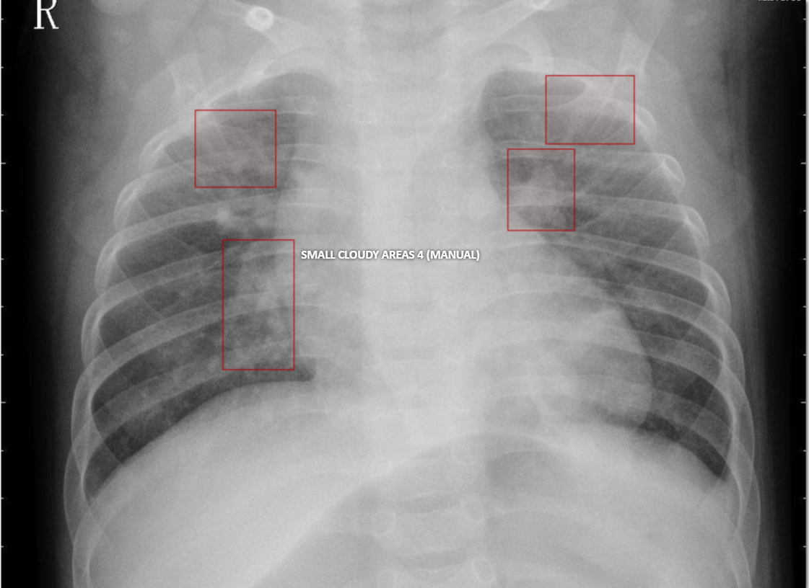
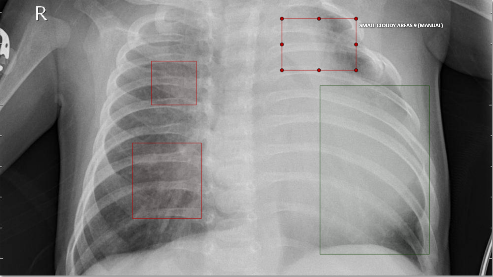
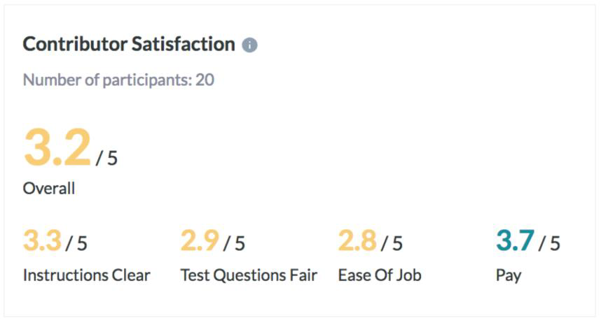

# AI Product Manager

## Udacity | Bertelsmann 

# Project Proposal
# Medical Annotation Job

#### Aswin Vijayakumar

## Data Labeling Approach

### Project Overview and Goal

What is the industry problem you are trying to solve? Why use ML in solving this task?

#### Answer: 

Create an Image Categorization Job that classifies the xray image of children as serious or healthy. The ultimate goal is to build a product that helps doctors quickly identify cases of pneumonia in children.

### Choice of Data Labels

What labels did you decide to add to your data? And why did you decide on these labels vs any other option?

#### Answer: 

Normal Pneumonia Unknown How likely - Likely - Neutral - Unlikely The first three points are necessary. The fourth point is on a scale from 1 to 3 indicating there is always information of diagnosis given at an attribute level. I did not provide too much detail as that would confuse the annotator and give a low feedback on the test questions.

## Test Questions & Quality Assurance

### Number of Test Questions

Considering the size of this dataset, how many test questions did you develop to prepare for launching a data annotation job?

#### Answer: 

5
I included 5% test questions giving option for improvement on test questions

### Improving a Test Question

Given the following test question which almost 100% of annotators missed, statistics, what steps might you take to improve or redesign this question?

#### Answer: 

I will add these two test questions as per the test data.

Is the X-Ray cloudy over the chest area?
- Yes / No

Do you see several small cloudy areas?
- Yes / No

Understanding the test questions in key in this section. So that includes those details that are provided on the image annotation part as that improves the efficacy of understanding.

### Contributor Satisfaction

Say you’ve run a test launch and gotten back results from your annotators; the instructions and test questions are rated below 3.5, what areas of your Instruction document would you try to improve (Examples, Test Questions, etc.)

#### Answer: 

Image / Data Annotations
Examples explained

The instruction document should include image or data annotations. The examples should be explained for a proper diagnosis.

Domain experts must not show a bias in selection i.e, a selection bias should not exist within the choice of educators, engineers or medical professionals.

The test questions must be enabled with discussions such as more learning from the event may be promoted.

## Limitations & Improvements

### Data Source

Consider the size and source of your data; what biases are built into the data and how might the data be improved?

#### Answer: 

**Attribution Bias:**
The designated category of the data is not proportionally distributed such as there are two or three cases that could be in How Likely situation. An annotator could enter likely for those situations where pneumonia is actually not present due to the detection of small cloudy areas.

**Coverage Bias:**
There is a coverage bias on the type of data that are presented to the domain experts. The choice of data and evenly distributed data must reach the domain experts such that they don’t feel dissatisfied about the job.

The data can be improved my allocating relevant distributed set to the annotators which is close to classifying the images using a static model and then presenting the data.

### Designing for Longevity

How might you improve your data labeling job, test questions, or product in the long-term?

#### Answer: 

Present to the users a demo run of the Appen task such that key problems are identified among the annotators. Also statically analyze the images for cloudy areas and thereby allocate the job to annotators.

In the allocation of an Appen job, increase the pay ratio by also assigning the rows to an annotator which was allocated to another annotator. This will improve the distribution of data provided to an annotator.

